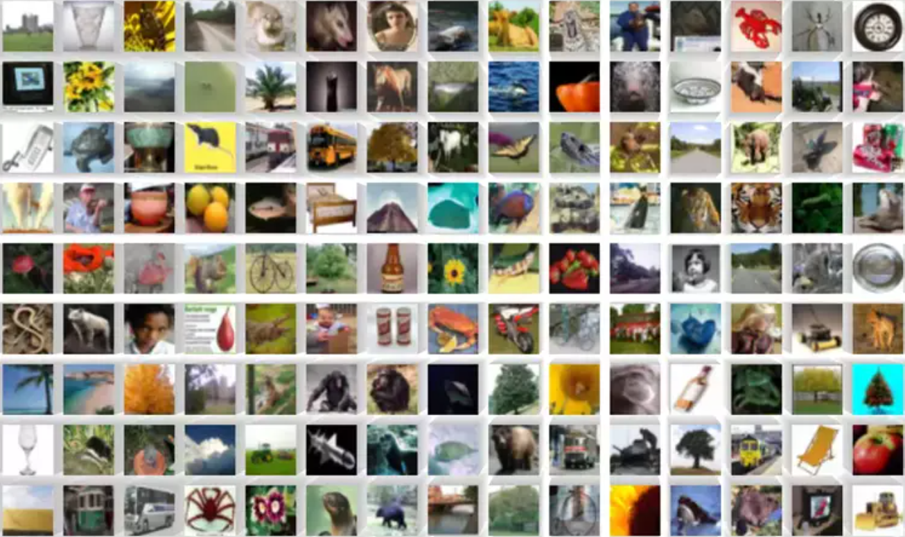

PyTorch - Convolutional Neural Networks
=======================================

Im Jahr 1998 veröffentlichte
`Yann LeCun <https://de.wikipedia.org/wiki/Yann_LeCun>`_ das erste Convolutional Neural Network (CNN) mit dem Namen `LeNet-5 <http://vision.stanford.edu/cs598_spring07/papers/Lecun98.pdf>`_.

Er war der erste, der die Architektur eines CNNs definierte und es erfolgreich auf die Erkennung von handgeschriebenen Ziffern 
anwandte.

.. image:: ../pytorch/YannLeCun.jpg
   :width: 300px
   :align: center
   :alt: Yann LeCun (Quelle: `https://de.wikipedia.org/wiki/Yann_LeCun`_)

In dieser Aufgabe werden Sie ein Convolutional Neural Network (CNN) mit PyTorch erstellen, das auf dem CIFAR-100-Datensatz trainiert wird.

`CIFAR-100 <https://www.kaggle.com/datasets/fedesoriano/cifar100>`_ ist ein Datensatz, der 100 verschiedene Klassen von Bildern enthält, darunter Tiere, Fahrzeuge und alltägliche Objekte.

In dieser Aufgabe arbeiten Sie in der Datei :file:`pytorch/cifar100.py`.

**Aufgabe 1**: Data Augmentation Pipeline
-----------------------------------------

In dieser Aufgabe werden Sie eine Data Augmentation Pipeline für den CIFAR-100-Datensatz erstellen.
Data Augmentation ist eine Technik, die verwendet wird, um die Vielfalt der Trainingsdaten zu erhöhen, indem verschiedene Transformationen auf die Bilder angewendet werden.
Dies kann helfen, die Generalisierungsfähigkeit des Modells zu verbessern und Overfitting zu reduzieren.
Sie können verschiedene Transformationen wie zufällige Drehungen, Skalierungen, Spiegelungen und Farbänderungen anwenden.
PyTorch bietet eine einfache Möglichkeit, Data Augmentation mit der `torchvision.transforms <https://docs.pytorch.org/vision/0.9/transforms.html>`_-Bibliothek zu implementieren.

Dabei verwendet man in der Regel die Klasse `torchvision.transforms.Compose <https://docs.pytorch.org/vision/stable/generated/torchvision.transforms.Compose.html>`_, um mehrere Transformationen zu kombinieren.
Sie sollten eine Pipeline erstellen, die mindestens folgende Transformationen enthält:

- **Konvertierung in Tensor**: Die `torchvision.transforms.ToTensor() <https://docs.pytorch.org/vision/main/generated/torchvision.transforms.ToTensor.html>`_-Klasse konvertiert die Bilder in PyTorch-Tensoren, die für das Training verwendet werden können.
- **Zufällige horizontale Spiegelung**: Die `torchvision.transforms.RandomHorizontalFlip() <https://docs.pytorch.org/vision/main/generated/torchvision.transforms.RandomHorizontalFlip.html>`_-Klasse spiegelt die Bilder zufällig horizontal, was bei vielen Objekten sinnvoll ist. Verwenden Sie `p=0.5`.
- **Zufällige Drehung**: Die Klasse `torchvision.transforms.RandomRotation() <https://docs.pytorch.org/vision/main/generated/torchvision.transforms.RandomRotation.html#torchvision.transforms.RandomRotation>`_ dreht die Bilder um einen zufälligen Winkel, um die Robustheit des Modells gegenüber verschiedenen Orientierungen zu erhöhen. Verwenden Sie `degrees=15`, um die Bilder um bis zu 15 Grad (plus oder minus) zu drehen.
- **Zufälliger Zuschnitt**: Die `torchvision.transforms.RandomCrop() <https://docs.pytorch.org/vision/main/generated/torchvision.transforms.RandomCrop.html>`_-Klasse schneidet die Bilder zufällig aus, um die Robustheit des Modells gegenüber verschiedenen Bildausschnitten zu erhöhen. Verwenden Sie `size=(32, 32)` und `padding=4`, um die Bilder auf die Größe 32x32 zu beschneiden und einen Rand von 4 Pixeln hinzuzufügen.
- **Normalisierung**: Die `torchvision.transforms.Normalize() <https://docs.pytorch.org/vision/main/generated/torchvision.transforms.Normalize.html>`_-Klasse normalisiert die Bilder, um die Pixelwerte in einen bestimmten Bereich zu bringen. Verwenden Sie `mean = (0.5, )` und `std = (0.5, )`, um die Bilder zu normalisieren. 

**Achtung**: Erstellen Sie auch eine zweite Pipeline für die Validierung, die nur die Konvertierung in Tensor und die Normalisierung enthält, ohne Data Augmentation.

.. admonition:: Lösung anzeigen
  :class: toggle

  .. code-block:: python 

    training_transform = transforms.Compose([
        transforms.ToTensor(),
        transforms.RandomHorizontalFlip(p=0.5),
        transforms.RandomRotation(degrees=15),
        transforms.RandomCrop(size=(32, 32), padding=4),
        transforms.Normalize((0.5,), (0.5,))
    ])

    validation_transform = transforms.Compose([
        transforms.ToTensor(),
        transforms.Normalize((0.5,), (0.5,))
    ])

**Aufgabe 2**: Der Datensatz laden
----------------------------------

Nun müssen Sie den CIFAR-100-Datensatz laden. PyTorch bietet eine einfache Möglichkeit, diesen Datensatz zu laden und in Trainings- und Validierungssets zu unterteilen.
Sie können den Datensatz mit der Klasse `torchvision.datasets.CIFAR100` laden. 

Instantieren Sie zwei `torchvision.datasets.CIFAR100 <https://docs.pytorch.org/vision/main/generated/torchvision.datasets.CIFAR100.html>`_-Objekte: eines für das Training und eines für die Validierung.
Verwenden Sie die `root`-Option, um den Speicherort des Datensatzes anzugeben, und die `download`-Option, um den Datensatz herunterzuladen, falls er nicht vorhanden ist.
Verwenden Sie die `train`-Option, um anzugeben, ob es sich um das Trainings- oder Validierungsset handelt.

.. admonition:: Lösung anzeigen
  :class: toggle

  .. code-block:: python 

    training_data = datasets.CIFAR100(
        root="data/cifar100",
        train=True,
        download=True,
        transform=training_transform
    )

    validation_data = datasets.CIFAR100(
        root="data/cifar100",
        train=False,
        download=True,
        transform=validation_transform
    )

Wrappen Sie die Datensätze in `torch.utils.data.DataLoader <https://pytorch.org/docs/stable/data.html#torch.utils.data.DataLoader>`_-Objekte, um sie in Batches laden zu können.
Ein Batch ist dabei eine Gruppe von Bildern, die gleichzeitig verarbeitet werden. 
Verwenden Sie die `batch_size`-Option, um die Größe der Batches festzulegen, und die `shuffle`-Option, um die Daten zufällig zu mischen.
Wählen Sie eine Batch-Größe zwischen 32 und 256, abhängig von Ihrer Hardware und den verfügbaren Ressourcen.

.. admonition:: Lösung anzeigen
  :class: toggle

  .. code-block:: python 

    training_set = torch.utils.data.DataLoader(training_data, batch_size=256, shuffle=True)
    validation_set = torch.utils.data.DataLoader(validation_data, batch_size=256, shuffle=False)

**Aufgabe 3**: Das Netzwerk definieren
--------------------------------------

Implementieren Sie nun die Klasse :class:`CNNNetwork`, die ein einfaches Convolutional Neural Network (CNN) mit mehreren Convolutional-Schichten und voll verbundenen Schichten definiert.    

.. autoclass:: pytorch.cifar100.CNNNetwork
   :members:
   :special-members: __init__

.. admonition:: Implementierung des Konstruktors anzeigen
  :class: toggle

  .. code-block:: python 

      def __init__(self):
        super().__init__()
        self.conv1 = nn.Conv2d(3, 16, kernel_size=3, padding="same")
        self.conv2 = nn.Conv2d(16, 32, kernel_size=3, padding="same")
        self.conv3 = nn.Conv2d(32, 64, kernel_size=3, padding="same")

        self.fc1 = nn.Linear(64 * 4 * 4, 512)
        self.fc2 = nn.Linear(512, 100)
        self.flatten = nn.Flatten()
        self.pool = nn.MaxPool2d(kernel_size=2, stride=2)

.. admonition:: Implementierung des Forward-Passes anzeigen
  :class: toggle

  .. code-block:: python 

      def forward(self, x):
        x = self.pool(torch.relu(self.conv1(x)))
        x = self.pool(torch.relu(self.conv2(x)))
        x = self.pool(torch.relu(self.conv3(x)))
        x = self.flatten(x)
        x = torch.relu(self.fc1(x))
        x = self.fc2(x)
        return x

**Aufgabe 4**: Das Training des Netzwerks   
-----------------------------------------

Dieses mal möchten wir das Training etwas ausführlicher gestalten.
Insbesondere möchten wir den Fortschritt des Trainings in Form von Metriken wie der Genauigkeit und dem Verlust verfolgen.
Ausserdem möchten wir sowohl den Trainings- als auch den Validierungsprozess in separaten Funktionen implementieren, um den Code übersichtlicher zu gestalten.

Da einige Module sich während des Trainings anders verhalten als während der Validierung, wie z.B. die Dropout-Schichten, müssen wir das Netzwerk in den richtigen Modus versetzen.
Rufen Sie dazu 
`model.train() <https://docs.pytorch.org/docs/stable/generated/torch.nn.Module.html#torch.nn.Module.train>`_
bzw. 
`model.eval() <https://docs.pytorch.org/docs/stable/generated/torch.nn.Module.html#torch.nn.Module.eval>`_ 
auf, um das Netzwerk in den Trainings- bzw. Validierungsmodus zu versetzen.

Während des Trainings müssen die Gradienten berechnet und die Gewichte aktualisiert werden.
Dazu müssen wie vorher mit `optimizer.zero_grad() <https://docs.pytorch.org/docs/stable/generated/torch.optim.Optimizer.zero_grad.html>`_ die Gradienten auf Null gesetzt werden, bevor der Vorwärtsdurchlauf durchgeführt wird.
Mit `loss.backward() <https://docs.pytorch.org/docs/stable/generated/torch.Tensor.backward.html>`_ und `optimizer.step() <https://pytorch.org/docs/stable/generated/torch.Tensor.backward.html>`_ werden die Gradienten berechnet, und mit `optimizer.step() <https://pytorch.org/docs/stable/generated/torch.optim.Optimizer.step.html>`_ werden die Gewichte aktualisiert.

Während der Validierung müssen die Gradienten nicht berechnet werden, da wir nur die Vorhersagen des Modells benötigen.
Sie können dies erreichen, indem Sie den Kontextmanager `torch.set_grad_enabled(train) <https://docs.pytorch.org/docs/stable/generated/torch.autograd.grad_mode.set_grad_enabled.html>`_ verwenden, der verhindert, dass PyTorch die Gradienten berechnet und speichert.

Um den durchschnittlichen Verlust und die Genauigkeit während des Trainings und der Validierung zu berechnen, müssen Sie während der Epoche Statistiken sammeln.
Summieren sie den Verlust und die Anzahl der korrekten Vorhersagen für jedes Batch auf.
Zählen Sie zusätzlich die Anzahl der Bilder in jedem Batch, um die Gesamtzahl der Bilder zu erhalten.

Nachdem das Netz eine Vorhesage für einen Batch gemacht hat stehen in

.. code-block:: python

    outputs = model(inputs)

die s.g. `Logits <https://wandb.ai/amanarora/Written-Reports/reports/Understanding-Logits-Sigmoid-Softmax-and-Cross-Entropy-Loss-in-Deep-Learning--Vmlldzo0NDMzNTU3>`_.  
Mit `torch.argmax(outputs, dim=1)  <https://pytorch.org/docs/stable/generated/torch.argmax.html>`_ können Sie die Klasse mit der höchsten Wahrscheinlichkeit auswählen.
Der `dim=1`-Parameter gibt an, dass die Argmax-Operation entlang der zweiten Dimension (der Klassen) durchgeführt wird. Sie erhalten damit zu jedem Bild die Klasse mit der höchsten Wahrscheinlichkeit.
Über einen Vergleich mit den wahren Labels können Sie die Anzahl der korrekten Vorhersagen zählen.

Implementieren Sie die Funktion :func:`pytorch.cifar100.epoch`, die das Netzwerk auf dem Trainingsset trainiert und den Fortschritt in Form von Metriken wie der Genauigkeit und dem Verlust verfolgt.

.. autofunction:: pytorch.cifar100.epoch

.. admonition:: Implementierung der Funktion anzeigen
  :class: toggle

  .. code-block:: python

      # Vorbereiten des Modells für Training oder Evaluation
      if train:
          model.train()
      else:
          model.eval()

      # Training des Modells
      total_loss = 0.0
      total_samples = 0
      total_correct = 0
      bar = tqdm(dataloader)
      for data, labels in bar:
          # Daten und Labels auf das Gerät verschieben
          data, labels = data.to(DEVICE), labels.to(DEVICE)
          
          # Gradienten zurücksetzen
          if train:
              optimizer.zero_grad()

          # Vorwärtsdurchlauf
          with torch.set_grad_enabled(train):
              outputs = model(data)

          # Verlust berechnen und Rückwärtsdurchlauf
          loss = criterion(outputs, labels)

          # Gradienten berechnen
          if train:
              loss.backward()
              optimizer.step()

          # Aktualisieren der Metriken
          total_loss += loss.item()
          total_samples += data.size(0)
          total_correct += (outputs.argmax(dim=1) == labels).sum().item()

          bar.set_description(f"Epoch {n} ({'T' if train else 'V'}), Loss: {total_loss / total_samples:.4f}, Accuracy: {total_correct / total_samples:.2%}")

Sobald Sie  die Funktion :func:`pytorch.cifar100.epoch` implementiert haben, können Sie das Netzwerk auf dem Trainingsset trainieren und auf dem Validierungsset evaluieren.
Starten Sie dazu das Skript

.. code-block:: bash

    python pytorch/cifar100.py
    Downloading https://www.cs.toronto.edu/~kriz/cifar-100-python.tar.gz to ./data\cifar-100-python.tar.gz
    100%|█████████████████████████████████████████████████████████████████████| 169001437/169001437 [00:22<00:00, 7650435.65it/s]
    Extracting ./data\cifar-100-python.tar.gz to ./data
    Files already downloaded and verified
    Epoch 1 (T), Loss: 0.0192, Accuracy: 1.87%:  12%|█████                                      | 23/196 [00:18<02:20,  1.23it/s]

**Aufgabe 5**: Batch-Normalisierung hinzufügen
----------------------------------------------

Fügen Sie `Batch-Normalisierungsschichten <https://arxiv.org/abs/1502.03167>`_ nach jeder Convolutional-Schicht hinzu, um die Trainingsgeschwindigkeit zu erhöhen und die Leistung des Modells zu verbessern.
Batch-Normalisierung normalisiert die Ausgaben der Convolutional-Schichten, um die Verteilung der Aktivierungen zu stabilisieren und die Trainingsgeschwindigkeit zu erhöhen.
Verwenden Sie Batch-Normalisierung dazu nach der Aktivierungsfunktion (z.B. ReLU) jeder Convolutional-Schicht.+

Sie können die Klasse `torch.nn.BatchNorm2d <https://pytorch.org/docs/stable/generated/torch.nn.BatchNorm2d.html>`_ verwenden, um Batch-Normalisierung für 2D-Bilder zu implementieren.
Diese muss wissen wieviele Kanäle die Convolutional-Schicht hat, daher müssen Sie die Anzahl der Kanäle als Argument übergeben.

.. admonition:: Implementierung der Batch-Normalisierung anzeigen
  :class: toggle

  .. code-block:: python

      def __init__(self):
        super().__init__()
        self.conv1 = nn.Conv2d(3, 16, kernel_size=3, padding="same")
        self.bn1 = nn.BatchNorm2d(16)
        self.conv2 = nn.Conv2d(16, 32, kernel_size=3, padding="same")
        self.bn2 = nn.BatchNorm2d(32)
        self.conv3 = nn.Conv2d(32, 64, kernel_size=3, padding="same")
        self.bn3 = nn.BatchNorm2d(64)
        ...

      def forward(self, x):
          x = self.pool(self.bn1(torch.relu(self.conv1(x))))
          x = self.pool(self.bn2(torch.relu(self.conv2(x))))
          x = self.pool(self.bn3(torch.relu(self.conv3(x))))
          x = self.flatten(x)
          x = torch.relu(self.fc1(x))
          x = self.fc2(x)
          return x

Beobachten sie den Effekt der Batch-Normalisierung auf die Trainingsgeschwindigkeit und die Leistung des Modells.

**Aufgabe 6**: Dropout hinzufügen
---------------------------------
Fügen Sie eine `Dropout-Schicht <https://www.cs.toronto.edu/~rsalakhu/papers/srivastava14a.pdf>`_ hinzu, um Overfitting zu reduzieren.
Dropout ist eine Technik, bei der während des Trainings zufällig einige Neuronen deaktiviert.
Dies hilft, Overfitting zu reduzieren, indem es das Modell zwingt, robuster zu werden und nicht von einzelnen Neuronen abhängig zu sein.
Sie können die Klasse `torch.nn.Dropout <https://pytorch.org/docs/stable/generated/torch.nn.Dropout.html>`_ verwenden, um Dropout zu implementieren.
Fügen Sie Dropout-Schichten nach den voll verbundenen Schichten hinzu, um Overfitting zu reduzieren.

.. admonition:: Implementierung des Dropouts anzeigen
  :class: toggle

  .. code-block:: python

      def __init__(self):
          super().__init__()
          ...
          self.dropout = nn.Dropout(p=0.5)

      def forward(self, x):
          x = self.pool(self.bn1(torch.relu(self.conv1(x))))
          x = self.pool(self.bn2(torch.relu(self.conv2(x))))
          x = self.pool(self.bn3(torch.relu(self.conv3(x))))
          x = self.flatten(x)
          x = torch.relu(self.fc1(x))
          x = self.dropout(x)  # Dropout nach der voll verbundenen Schicht
          x = self.fc2(x)
          return x

**Musterlösung**
----------------

:doc:`cnn_source`