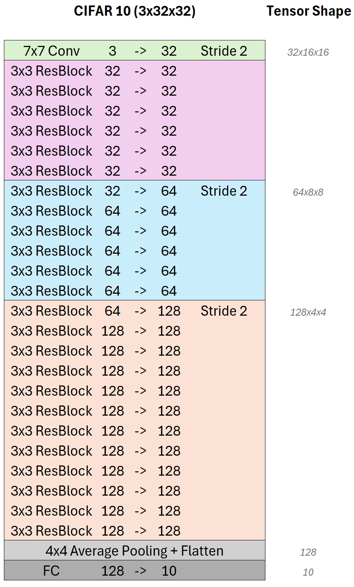

ResNet
======

In diesem Abschnitt finden Sie die Aufgaben und Beispiele zur Implementierung von ResNet-Architekturen in PyTorch.
Die ResNet-Architektur ist bekannt für ihre Fähigkeit, tiefe neuronale Netzwerke zu trainieren, indem sie 
Residualverbindungen verwendet, die den Gradientenfluss verbessern und das Problem der verschwindenden 
Gradienten verringern.

ResNet wurde Ursprünglich von Kaiming He et al. in ihrem Paper "`Deep Residual Learning for Image Recognition <https://arxiv.org/pdf/1512.03385>`_"
vorgestellt. Es hat sich als äußerst effektiv erwiesen und wurde in vielen Anwendungen der Computer Vision 
eingesetzt.

**Aufgabe 1**: ResNet-Block implementieren
------------------------------------------

Wir implementieren zunächst den grundlegenden ResNet-Block, der die Residualverbindung enthält.
Aus diesem Block werden dann die tieferen ResNet-Architekturen aufgebaut.

.. image:: ./resnet-block.svg
   :width: 600px
   :align: center

Der ResNet-Block besteht aus zwei aufeinanderfolgenden Convolutional-Layern, gefolgt von Batch Normalization und ReLU-Aktivierung.
Die Residualverbindung addiert den Eingang des Blocks zu der Ausgabe der zweiten Convolutional-Schicht.

Unser Netzwerk wird zwei Varianten des ResNet-Blocks enthalten. Die linke Architektur zeigen den
ResNet-Block ohne Downsampling (Stride). Die Anzahl der Kanäle bleibt gleich.

Die rechte Architektur zeigt den ResNet-Block mit Downsampling, bei dem gleichzeitig die Anzahl der Kanäle verdoppelt wird.
Damit die Residualverbindung funktioniert, muss der Eingang des Blocks auf die gleiche Größe wie die Ausgabe transformiert werden.
Dazu verwenden wir eine 1x1 Convolutional-Schicht, die die Anzahl der Kanäle anpasst und den selben Stride wie die Convolutional-Schicht verwendet.

Alle Faltungen sind mit einer Kernelgröße von 3x3 und Padding von 1 konfiguriert, um die räumliche Größe der Eingabe beizubehalten.
Sie verwenden ausserdem keinen Bias. 

Implementieren Sie die Klasse `ResidualBlock` in der Datei `resnet/resnet.py`, die den ResNet-Block mit und ohne Downsampling enthält.

.. autoclass:: resnet.ResidualBlock
   :members:
   :special-members: __init__, forward
   :undoc-members:
   :show-inheritance:

.. admonition:: Musterlösung für den Konstruktur __init__ anzeigen
   :class: toggle

   .. code-block:: python

       class ResidualBlock(nn.Module):
           def __init__(self, in_channels, out_channels, stride=1):
              super(ResidualBlock, self).__init__()
              self.conv1 = nn.Sequential(
                  nn.Conv2d(in_channels, out_channels, kernel_size=3, padding=1, stride=stride, bias=False),
                  nn.BatchNorm2d(out_channels),
              )
              self.conv2 = nn.Sequential(
                  nn.Conv2d(out_channels, out_channels, kernel_size=3, padding=1, bias=False),
                  nn.BatchNorm2d(out_channels)
              )
              self.relu = nn.ReLU(inplace=True)

              # Shortcut connection
              if stride != 1 or in_channels != out_channels:
                  self.shortcut = nn.Conv2d(in_channels, out_channels, kernel_size=1, stride=stride, bias=False)
              else:
                  self.shortcut = nn.Identity()

.. admonition:: Musterlösung für den Forwärtspass anzeigen
   :class: toggle

   .. code-block:: python

       def forward(self, x):
           residual = self.shortcut(x)
           out = self.relu(self.conv1(x))
           out = self.relu(self.conv2(out) + residual)
           return out

**Aufgabe 2**: Ein einfaches ResNet-Modell implementieren
---------------------------------------------------------

Nachdem wir den ResNet-Block implementiert haben, können wir ein einfaches ResNet-Modell erstellen.
Das Modell besteht aus mehreren ResNet-Blöcken, die in verschiedenen Konfigurationen angeordnet sind.

Die Architektur, die wir in diesem Abschnitt implementieren, ist eine an den CIFAR-10-Datensatz angepasste Version von ResNet.
Wir verwenden insgesamt 25 Faltungsschichten, die in 4 Blöcken organisiert sind.

Grundsätzlichen werden alle Convolutional-Schichten der Architektur von einer Batch Normalization-Schicht gefolgt,
die die Normalisierung der Aktivierungen ermöglicht und die Trainingsstabilität verbessert. Als Nicht-Linearität verwenden wir die ReLU-Aktivierungsfunktion
nach jeder Batch-Normalization-Schicht. Alle Convolutional-Schichten verwenden keinen Bias da dieser durch die Batch Normalization-Schicht ersetzt wird.

In der ersten Schicht (grün) verwenden wir die einzige 7x7 Convolutional-Schicht des Netzwerkes. 
Die 3 Eingangskanäle werden auf 32 Kanäle erweitert. Gleichzeit verringert ein Stride von 2 die räumliche Dimension der Eingabe um die Hälfte.

In der folgenden Schichten verwenden wir 6 aufeinanderfolgende ResNet-Blöcke (pink), die jeweils 32 Kanäle haben.
Die Shortcut-Verbindung jedes ResNet-Blocks ermöglicht einen stabilen Gradientenfluss durch das Netzwerk.
Die Anzahl der Kanäle bleibt in diesen Blöcken konstant, da sie keinen Downsampling-Schritt enthalten.

Die nächsten 6 ResNet-Blöcke (blau) verdoppeln die Anzahl der Kanäle auf 64 und verwenden einen Downsampling-Schritt mit einem Stride von 2.
Das Downsampling sowie die Dimensionserhöhung erfolgt im ersten der sechs Blöcke. Die restlichen fünf Blöcke verwenden die gleiche Anzahl von Kanälen und 
behalten die räumliche Dimension bei.

Die letzte Stufe besteht aus insgesamt 12 ResNet-Blöcken (orange), wobei wieder die Anzahl der Kanäle im ersten Block auf 128 verdoppelt wird während eine
Stride von 2 im ersten Block die räumliche Auflösung wieder halbiert.

Das Netzwerk endet mit einer globalen Durchschnittspooling-Schicht, die die räumliche Dimension auf 1x1 reduziert.
Anschließend folgt eine voll verbundene Schicht, die die Anzahl der Kanäle auf 10 reduziert, um die 10 Klassen des 
CIFAR-10-Datensatzes zu klassifizieren.

**Implementieren** Sie nun zunächst die Methode `Resnet._make_layer` in der Datei `resnet/resnet.py`, die eine Sequenz von ResNet-Blöcken erstellt.

.. automethod:: resnet.ResNet.make_layer

.. admonition:: Musterlösung anzeigen
   :class: toggle

   .. code-block:: python

       def make_layer(self, block, out_channels, blocks, stride=1):
          strides = [stride] + [1] * (num_blocks - 1)
          layers = []
          for s in strides:
              layers.append(ResidualBlock(in_channels, out_channels, s))
              in_channels = out_channels

          return nn.Sequential(*layers)